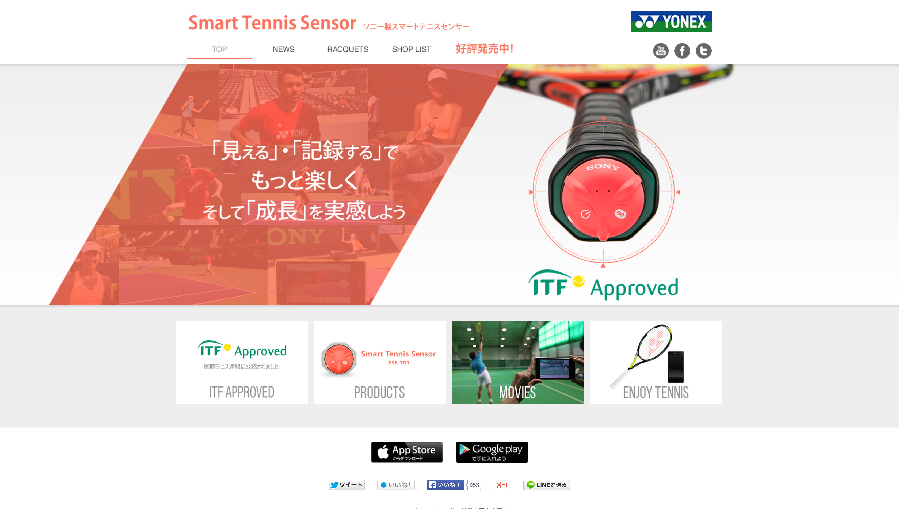
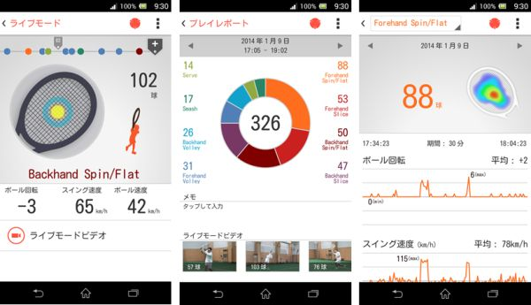
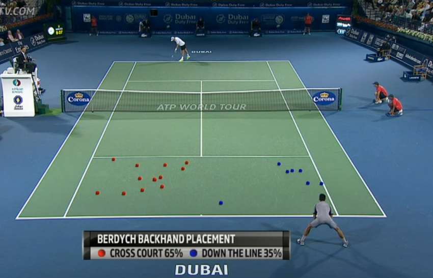
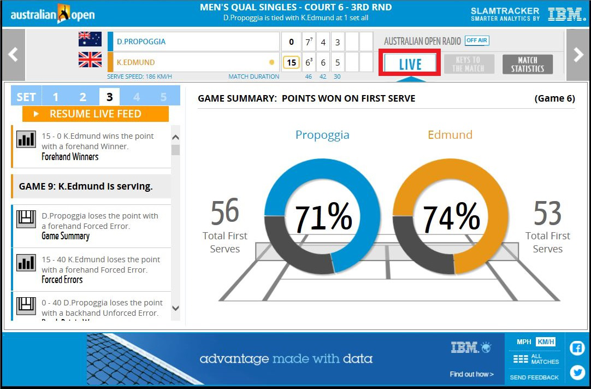

name: inverse
layout: true
class: center, middle, inverse
---

background-image: url('./image/tennis-ball.png')

# IT in Tennis

[Presenter: Tamrin]

.footnote[DIT Lightning Talk in Rohm PJ Startup Camp]

---

## Presenter Profile

---

layout: false

.left-column[
  ## Profile
]

.right-column[
  プレゼンターとテニス
  - テニスとの出会いは小学２年生
  - 地元の名門スクールに通う
  - 中学受験期に一時テニスを離れる
  - 中学では硬式テニス部に所属
  - そのまま高校も硬式テニス部に
  - 大学で部活を続けるレベルでは無かったのでサークルにて細々と活動
   - （同志社は一昨年全国３位です）
  - グランドスラムは欠かさず観ています
]

---

.left-column[
  ## Profile
  ## Recode
]

.right-column[
  主な戦績
  - 中学体育連盟 京都市内大会
   - ダブルス 準優勝 2回
   - 団体 優勝 5回
  - 中学体育連盟 京都府下大会
   - ダブルス ベスト 4
   - 団体 準優勝
  - 中学体育連盟 近畿大会
   - ダブルス ベスト16
   - 団体 初戦敗退
  - 高校体育連盟 京都府下大会
   - 団体 第3位
]

---

template: inverse

# 今日話したいこと

---

template: inverse

# 最近のテニスって

# すっごいハイテク

---

background-image: url(./image/iot.png)

---

.left-column[
  ## Example

  ### - IoT
]

.right-column[
  ## IoT = Internet of Things

 「モノのインターネット」

  - 従来のPCやサーバ、プリンタなどの情報機器のみならず、様々なモノをインターネットに接続しようという試み
  - 「Internet of Everything」や「Smart Everything」とも

]

---

template: inverse

## ラケットにセンサ

---

template: inverse

### ショットの種類、ボールの回転、速度、

### 当たった場所、スウィングの速度など計測可能

---

background-image: url(./image/challenge.jpg)

---

.left-column[
  ## Example

  ### - IoT

  ### - Challenge System
]

.right-column[
  ## Challenge System

  「チャレンジシステム」

  - 審判の補助を行うコンピュータ映像処理システム
  - 試合中にボールの位置や軌道を追跡 / 分析
  - ミサイル追跡の技術が応用されたカメラを10台使用
  - 軌道の分析結果はCGを使って再現
  - 選手の意義申し立てがあった際に利用される
]

---

template: inverse

<iframe width="640" height="360" src="https://www.youtube.com/embed/XhQyVnwBXBs?rel=0" frameborder="0" allowfullscreen></iframe>

### Inside Hawkeye
#### (全豪オープンでのホークアイ運用)

---

template: inverse

### どのコースに打ち分けているかを表示

---

background-image: url(./image/ibm.png)

---

.left-column[
  ## Example

  ### - IoT

  ### - Challenge System

  ### - Big Data
]

.right-column[
  ## Big Data

  「ビッグデータ解析」

  - IBMがグランドスラムでリアルタイム解析を行っている
  - ライブスコアという試合の進行状況配信システムに導入
  - 収集された各パーセンテージ、試合のターニングポイントの解析結果などを見ることがデキる

]

---

template: inverse

### 全豪オープンでのライブスコアシステム

---

template: inverse

# Summary

---

.left-column[
  ## Summary
]

.right-column[
  ### テニスのIT化が進んでいる

  - ITの導入により、さらにエンターテインメント性に富んだコンテンツとなり得る
  - API等が公開されれば、自分で開発ができるかも
  - 自分の身近なものとITを組み合わせたらどうなるか、面白いアイデアは無いか考えてみよう
]

